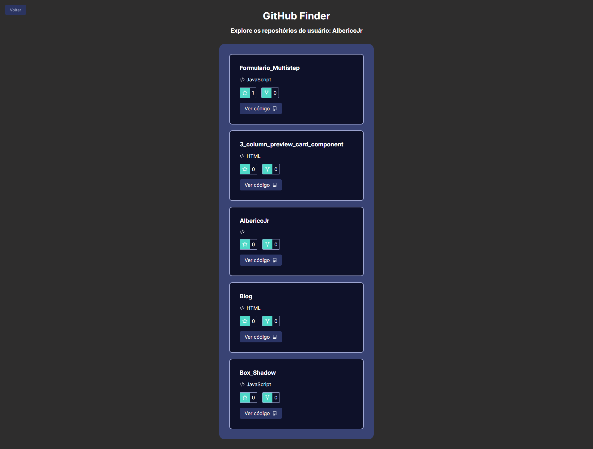

# GitHub Finder

Projeto criado utilizando React e TypeScript, o site é uma dashboard onde você pode esta pesquisando qualquer perfil do GitHub que ele ira mostrar o perfil junto com os seguidores e pessoas que são seguidas pelo perfil, e também irar mostrar os projeto que o perfil tem no seu GitHub.


## Stack utilizada

**Front-end:** React, TypeScript

## Imagens




## Rodando localmente

Clone o projeto

```bash
  git clone https://link-para-o-projeto
```

Entre no diretório do projeto

```bash
  cd my-project
```

Instale as dependências

```bash
  npm install
```

Inicie o servidor

```bash
  npm run start
```


## Etiquetas

Adicione etiquetas de algum lugar, como: [shields.io](https://shields.io/)

[](https://choosealicense.com/licenses/mit/)
[](https://opensource.org/licenses/)
[](http://www.gnu.org/licenses/agpl-3.0)


## Autores

- [@AlbericoJr](https://www.github.com/albericojr)


## Licença

[MIT](https://choosealicense.com/licenses/mit/)

